# Module 1: Fundamentals of Machine Learning and Artificial Intelligence

> **Course:** AWS Artificial Intelligence Practitioner (AIF-C01)
> **Source:** Fundamentals of Machine Learning and Artificial Intelligence — AWS / Coursera
> **Renders best on GitHub** — Mermaid diagrams display automatically

---

## Table of Contents

1. [The AI/ML Hierarchy](#1-the-aiml-hierarchy)
2. [Training Data](#2-training-data)
3. [The Machine Learning Process](#3-the-machine-learning-process)
4. [ML Learning Types](#4-ml-learning-types)
5. [Inferencing](#5-inferencing)
6. [Deep Learning and Neural Networks](#6-deep-learning-and-neural-networks)
7. [Computer Vision and NLP](#7-computer-vision-and-nlp)
8. [Foundation Models](#8-foundation-models)
9. [Large Language Models](#9-large-language-models)
10. [Generative Model Types](#10-generative-model-types)
11. [FM Optimization Techniques](#11-fm-optimization-techniques)
12. [AWS AI/ML Services Stack](#12-aws-aiml-services-stack)
13. [Cost Considerations](#13-cost-considerations)
14. [Exam Cheat Sheet](#14-exam-cheat-sheet)

---

## 1. The AI/ML Hierarchy

> AI is the broadest concept. Each inner layer is a more specific approach to achieving AI.

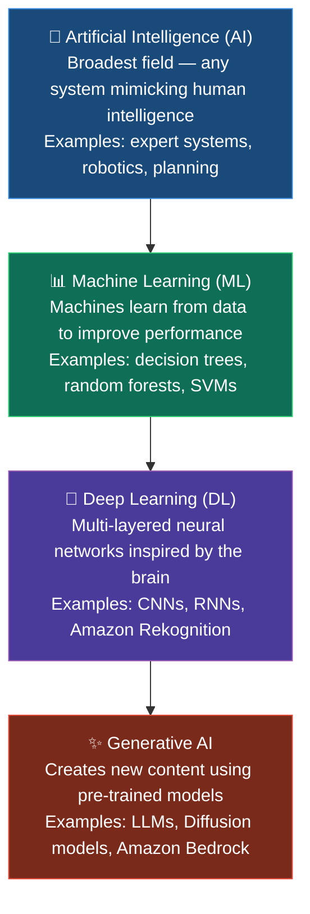


### Visual: Nested Rings

```
╔══════════════════════════════════════════════════════╗
║          Artificial Intelligence (AI)                ║
║   (Expert systems, robotics, planning, ML, ...)      ║
║  ╔════════════════════════════════════════════╗      ║
║  ║         Machine Learning (ML)              ║      ║
║  ║   (Decision trees, SVMs, clustering ...)   ║      ║
║  ║  ╔════════════════════════════════════╗    ║      ║
║  ║  ║       Deep Learning (DL)           ║    ║      ║
║  ║  ║  (Neural networks, CNNs, RNNs ...) ║    ║      ║
║  ║  ║  ╔══════════════════════════════╗  ║    ║      ║
║  ║  ║  ║      Generative AI           ║  ║    ║      ║
║  ║  ║  ║  (LLMs, Diffusion, GANs ...) ║  ║    ║      ║
║  ║  ║  ╚══════════════════════════════╝  ║    ║      ║
║  ║  ╚════════════════════════════════════╝    ║      ║
║  ╚════════════════════════════════════════════╝      ║
╚══════════════════════════════════════════════════════╝
```

### Key Definitions


| Concept           | Definition                                | AWS Example                    |
| ----------------- | ----------------------------------------- | ------------------------------ |
| **AI**            | Any system mimicking human intelligence   | Amazon Lex (conversational AI) |
| **ML**            | Machines learn patterns from data         | Amazon SageMaker AI            |
| **Deep Learning** | Multi-layered neural networks             | Amazon Rekognition             |
| **Generative AI** | Creates new content from learned patterns | Amazon Bedrock                 |


> **⚠️ Exam Key:** Generative AI adapts pre-trained deep learning models **without requiring full retraining** for every new task.

---

## 2. Training Data

> **"Garbage in, garbage out"** — your model is only as good as its training data. Data preparation is the single most critical stage of ML.

### Data Type Matrix

```
                    ┌──────────────────┬──────────────────────┐
                    │   STRUCTURED     │   UNSTRUCTURED       │
                    │ (rows & columns) │  (no fixed format)   │
  ┌─────────────────┼──────────────────┼──────────────────────┤
  │                 │                  │                      │
  │    LABELED      │ • CSV with tags  │ • Tagged images      │
  │  (has a target) │ • Database with  │ • Annotated emails   │
  │                 │   known outcomes │ • Transcribed audio  │
  │                 │                  │                      │
  │  → Supervised   │                  │                      │
  │    learning     │                  │                      │
  ├─────────────────┼──────────────────┼──────────────────────┤
  │                 │                  │                      │
  │   UNLABELED     │ • Raw databases  │ • Photos (no tags)   │
  │  (no target)    │ • Transactions   │ • Raw audio files    │
  │                 │   with no labels │ • Unannotated videos │
  │                 │                  │                      │
  │  → Unsupervised │                  │                      │
  │    learning     │                  │                      │
  └─────────────────┴──────────────────┴──────────────────────┘
```

### Structured vs. Unstructured

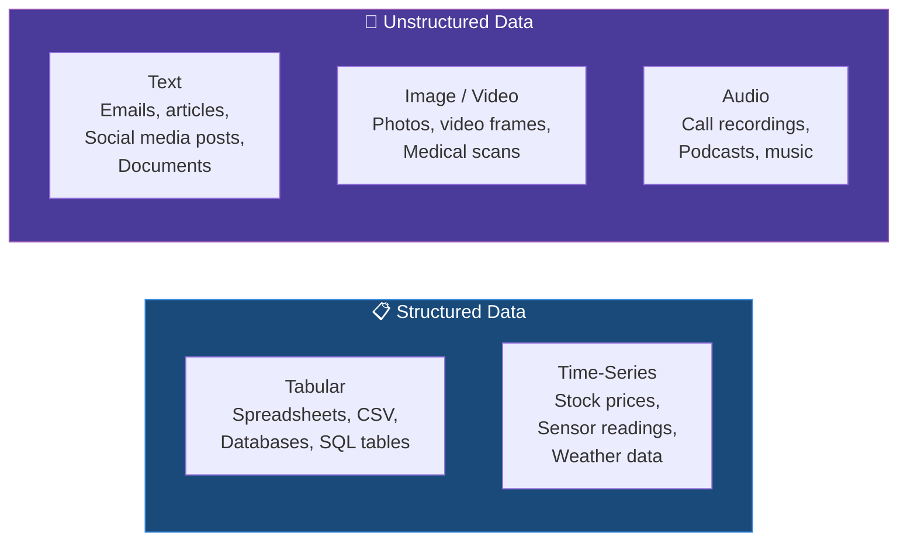


### Data Preparation Pipeline

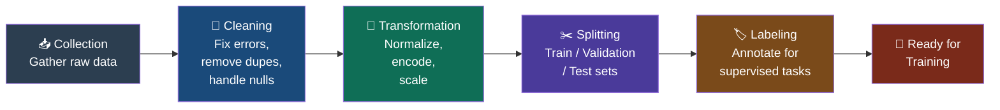


> **⚠️ Exam Key:** When a model has poor accuracy, the most likely cause is **bad training data**, not the algorithm. Fix the data first.

---

## 3. The Machine Learning Process

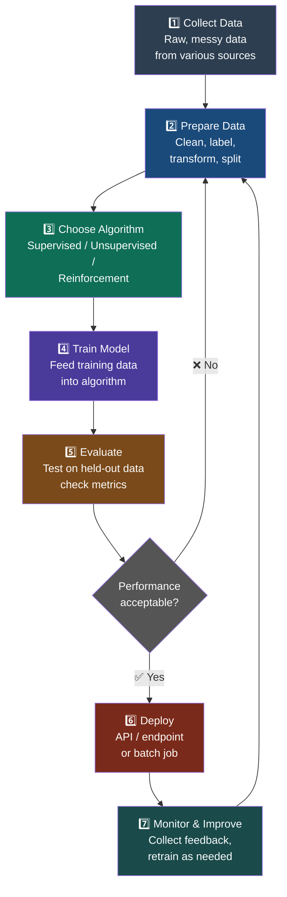


---

## 4. ML Learning Types

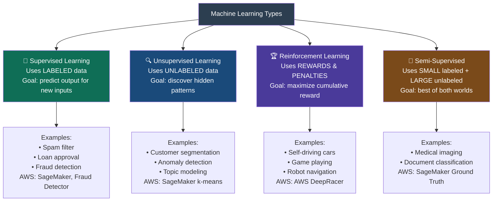


### Side-by-Side Comparison

```
┌─────────────────────┬─────────────────────┬─────────────────────┐
│   SUPERVISED        │   UNSUPERVISED      │   REINFORCEMENT     │
│   LEARNING          │   LEARNING          │   LEARNING          │
├─────────────────────┼─────────────────────┼─────────────────────┤
│ Uses labeled data   │ Uses unlabeled data │ No labels — uses    │
│                     │                     │ rewards/penalties   │
├─────────────────────┼─────────────────────┼─────────────────────┤
│ Tasks:              │ Tasks:              │ Tasks:              │
│ • Classification    │ • Clustering        │ • Game playing      │
│ • Regression        │ • Anomaly detection │ • Robotics          │
│                     │ • Dimensionality    │ • Ad bidding        │
│                     │   reduction         │                     │
├─────────────────────┼─────────────────────┼─────────────────────┤
│ Example:            │ Example:            │ Example:            │
│ Spam filter —       │ Customer            │ AWS DeepRacer car   │
│ emails labeled      │ segmentation —      │ learns to race via  │
│ spam/not spam       │ group by behavior   │ reward signals      │
├─────────────────────┼─────────────────────┼─────────────────────┤
│ AWS: SageMaker,     │ AWS: SageMaker      │ AWS: DeepRacer,     │
│ Fraud Detector      │ (k-means)           │ SageMaker RL        │
└─────────────────────┴─────────────────────┴─────────────────────┘
```

### Quick Decision Guide

```
Has labeled data with known outcomes?         ──→  Supervised learning
No labels — find hidden groups / patterns?    ──→  Unsupervised learning
Agent optimizes through trial and error?      ──→  Reinforcement learning
Lots of data but only some is labeled?        ──→  Semi-supervised learning
```

---

## 5. Inferencing

> **Inferencing** = using a trained model to make predictions on new, unseen data.

### End-to-End ML Pipeline

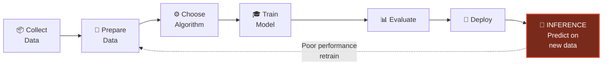


### Batch vs. Real-Time

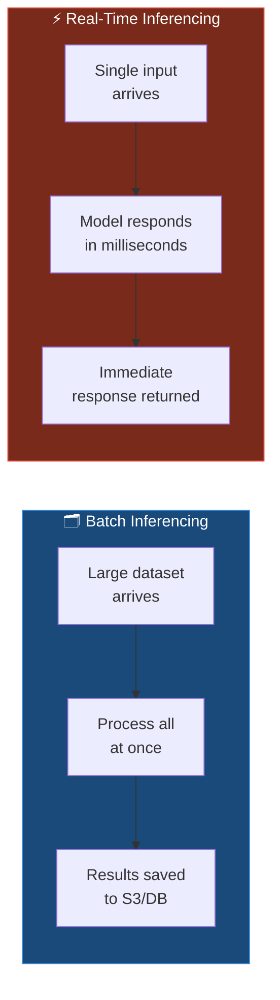


### Comparison Table

```
┌──────────────────┬──────────────────────────┬──────────────────────────┐
│ Dimension        │ BATCH                    │ REAL-TIME                │
├──────────────────┼──────────────────────────┼──────────────────────────┤
│ Speed priority   │ Accuracy over speed      │ Speed above all          │
│ Latency          │ Not critical             │ Critical (milliseconds)  │
│ Data volume      │ Large datasets at once   │ One input at a time      │
│ Cost             │ Lower — on-demand        │ Higher — always-on       │
│ Use cases        │ Overnight recs, reports, │ Chatbots, fraud detect., │
│                  │ daily sentiment analysis │ self-driving cars        │
│ AWS service      │ SageMaker Batch          │ SageMaker Real-Time      │
│                  │ Transform                │ Endpoints                │
└──────────────────┴──────────────────────────┴──────────────────────────┘
```

> **⚠️ Exam Key:** Real-time endpoints run 24/7 → higher cost. Batch spins up on demand → lower cost. Choose batch whenever latency is not critical.

---

## 6. Deep Learning and Neural Networks

### Neural Network Architecture

```
                INPUT           HIDDEN          HIDDEN          OUTPUT
                LAYER           LAYER 1         LAYER 2         LAYER
                ┌─────┐
   Age ────────►│     │
                │  N  │──┐     ┌─────┐         ┌─────┐
                └─────┘  ├────►│     │──┐       │     │──┐
                         │     │  H  │  ├──────►│  H  │  ├────► Buy: 82%
                ┌─────┐  │     └─────┘  │       └─────┘  │
  Spend ────────►│     │──┤             │                 │
                │  N  │  │     ┌─────┐  │       ┌─────┐  ├────► No:  18%
                └─────┘  ├────►│     │──┤       │     │──┘
                         │     │  H  │  ├──────►│  H  │
                ┌─────┐  │     └─────┘  │       └─────┘
 Visits ────────►│     │──┘             │
                │  N  │         ┌─────┐ │
                └─────┘    ────►│     │─┘
                                │  H  │
                                └─────┘

        Thicker connections = higher learned weights = more influence
```

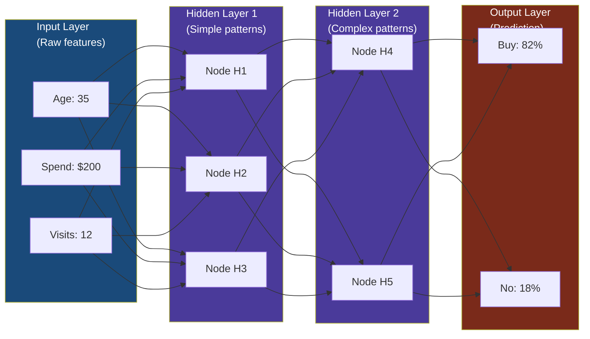


### How Neural Networks Learn (Backpropagation)

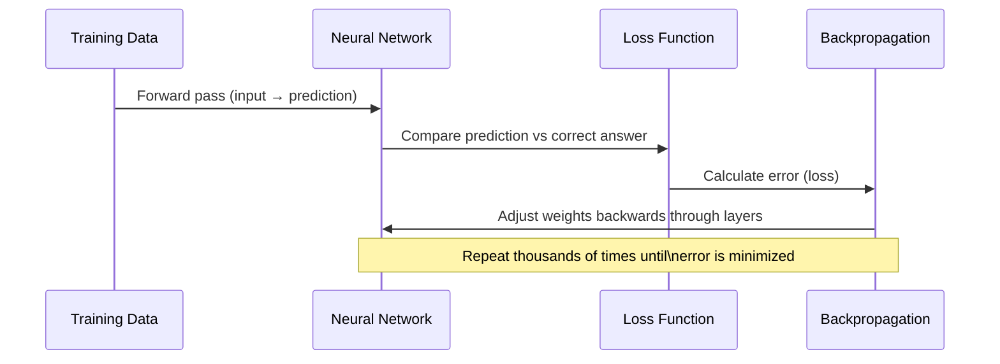


### Key Neural Network Concepts


| Term                | Definition                                                                             |
| ------------------- | -------------------------------------------------------------------------------------- |
| **Node / Neuron**   | Basic processing unit — receives inputs, applies a function, passes output forward     |
| **Layer**           | Group of nodes — Input, Hidden, or Output                                              |
| **Hidden Layer**    | Intermediate layers where the network learns internal representations                  |
| **Weight**          | Strength of connection between nodes — adjusted during training                        |
| **"Deep"**          | Many hidden layers — enables learning of complex, abstract patterns                    |
| **Backpropagation** | Training mechanism — calculates error and adjusts weights backward through the network |


---

## 7. Computer Vision and NLP

### AWS Services by Domain

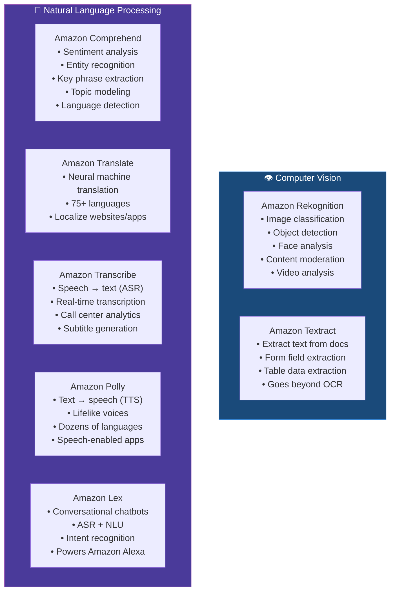


### NLP Services — Quick Reference

```
┌──────────────────┬────────────────────────────────────────────────────┐
│ SERVICE          │ WHAT IT DOES                                       │
├──────────────────┼────────────────────────────────────────────────────┤
│ Comprehend       │ UNDERSTANDS text — sentiment, entities, topics     │
│ Translate        │ CONVERTS between languages                         │
│ Transcribe       │ SPEECH → TEXT (ears) — ASR service                 │
│ Polly            │ TEXT → SPEECH (voice) — TTS service                │
│ Lex              │ BUILDS chatbots — ASR + intent recognition         │
│ Textract         │ EXTRACTS data from scanned documents               │
│ Kendra           │ SEARCHES across enterprise documents               │
└──────────────────┴────────────────────────────────────────────────────┘

Memory aid:
  Comprehend  = comprehend (understand)
  Transcribe  = transcribe (write down what's spoken)
  Polly       = Polly talks  (text → voice)
  Lex         = lexicon (language + intent for chatbots)
```

---

## 8. Foundation Models

### What is a Foundation Model?

> A **Foundation Model (FM)** is a large model pre-trained on internet-scale data that can be adapted to perform many different tasks — text generation, summarization, image creation, Q&A, and more.

### FM Lifecycle

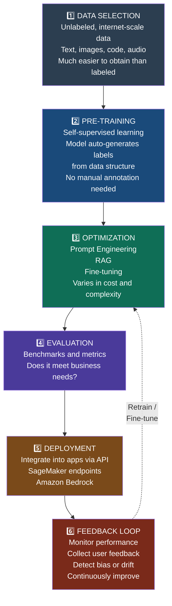


### Self-Supervised Learning Explained

```
Traditional Supervised:   [Image] + [Label: "cat"] ──→ Model learns
Traditional Unsupervised: [Image] (no label)        ──→ Model finds patterns
Self-Supervised:          "The ___ sat on the mat"  ──→ Model predicts "cat"
                           (label generated FROM data itself)
```

> **⚠️ Exam Key:** FMs use **self-supervised learning** — this is why they can train on billions of documents without expensive manual labeling.

### Amazon Bedrock FM Providers

```
┌─────────────────┬──────────────────┬────────────────────────────┐
│ PROVIDER        │ MODEL(S)         │ STRENGTHS                  │
├─────────────────┼──────────────────┼────────────────────────────┤
│ Anthropic       │ Claude           │ Long context, reasoning    │
│ Meta            │ Llama            │ Open-source, versatile     │
│ Cohere          │ Command, Embed   │ Enterprise, embeddings     │
│ Mistral AI      │ Mistral, Mixtral │ Efficient, multilingual    │
│ Stability AI    │ Stable Diffusion │ Image generation           │
│ AI21 Labs       │ Jurassic         │ Text generation            │
│ Amazon          │ Titan            │ Text, image, embeddings    │
└─────────────────┴──────────────────┴────────────────────────────┘
```

---

## 9. Large Language Models

### How LLMs Process Text

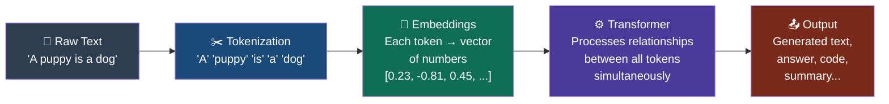


### Tokens, Embeddings, Vectors

```
TOKENS:
  "A puppy is to dog as a kitten is to cat."
   ─┬─  ──┬──  ─┬  ─┬─  ─┬  ─┬  ──┬──   ─┬  ─┬─
    │     │     │   │    │   │     │        │   │
  [A] [puppy] [is] [to] [dog] [as] [kitten] [is] [cat]

EMBEDDINGS (semantic space):
  "cat"    vector: [0.82, -0.31, 0.56, ...]
  "kitten" vector: [0.79, -0.28, 0.53, ...]  ← very close to "cat"
  "dog"    vector: [0.75, -0.22, 0.48, ...]  ← close to "cat" family
  "car"    vector: [-0.42, 0.91, -0.23, ...] ← far away

  Words with similar meaning cluster together in vector space.
  This is why LLMs understand: "cat is to kitten as dog is to puppy"
```

---

## 10. Generative Model Types

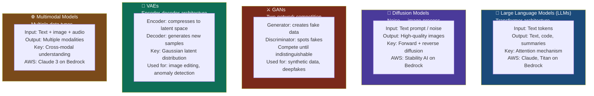


### Diffusion Model: Forward + Reverse Process

```
FORWARD DIFFUSION (training — add noise):
  [Clear Image] ──noise──→ [Slightly noisy] ──noise──→ ... ──→ [Pure noise]
        🖼️                        🌫️                              ❄️

REVERSE DIFFUSION (generation — remove noise):
  [Pure noise] ──denoise──→ [Less noisy] ──denoise──→ ... ──→ [Generated Image]
        ❄️                       🌫️                                🖼️
```

### GAN Architecture

```
  Random Noise ──→ [GENERATOR] ──→ Fake image ──┐
                                                  ▼
                                          [DISCRIMINATOR] ──→ Real or Fake?
                                                  ▲
                  Real training data ─────────────┘

  Training loop:
  1. Generator tries to produce images that fool the discriminator
  2. Discriminator learns to spot fakes
  3. Both improve until generator produces indistinguishable images
```

---

## 11. FM Optimization Techniques

> Three techniques to optimize FM output — they vary in **cost**, **complexity**, and whether they **change model weights**.

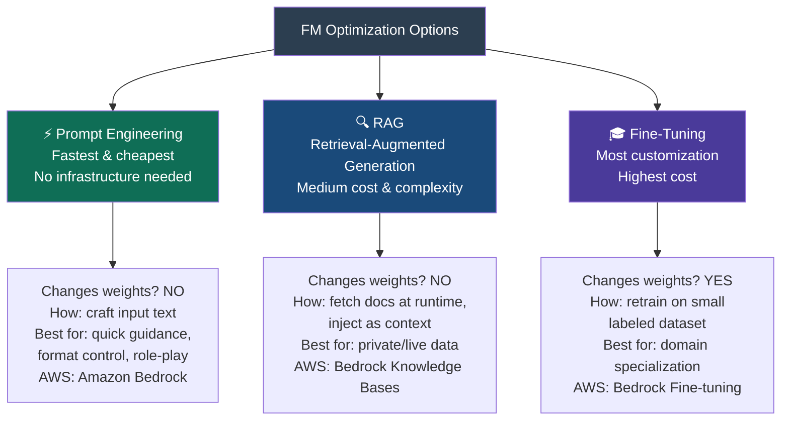


### Side-by-Side Comparison

```
┌──────────────────────┬─────────────────┬────────────────────┬──────────────────────┐
│ Dimension            │ PROMPT ENG.     │ RAG                │ FINE-TUNING          │
├──────────────────────┼─────────────────┼────────────────────┼──────────────────────┤
│ Changes weights?     │ ❌ No           │ ❌ No              │ ✅ Yes               │
│ Cost                 │ 💚 Low          │ 🟡 Medium          │ 🔴 High              │
│ Speed to implement   │ Hours           │ Days               │ Days to weeks        │
│ Data needed          │ Just a prompt   │ Document knowledge │ Labeled task dataset │
│                      │                 │ base               │                      │
│ Best for             │ Quick guidance, │ Real-time private/ │ Domain-specific      │
│                      │ format control  │ changing data      │ language and tone    │
│ AWS service          │ Amazon Bedrock  │ Bedrock Knowledge  │ Bedrock Fine-tuning  │
│                      │                 │ Bases              │                      │
└──────────────────────┴─────────────────┴────────────────────┴──────────────────────┘
```

### RAG Architecture

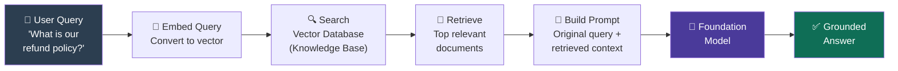


### Prompt Elements

```
You are an experienced journalist that excels at condensing long
articles into concise summaries.           ← INSTRUCTION (role + task)
──────────────────────────────────────────
Use a neutral, professional tone.          ← CONTEXT (guidance)
──────────────────────────────────────────
Text: [Long article text goes here]        ← INPUT DATA
──────────────────────────────────────────
Summarize in 2-3 sentences.                ← OUTPUT INDICATOR
```

---

## 12. AWS AI/ML Services Stack

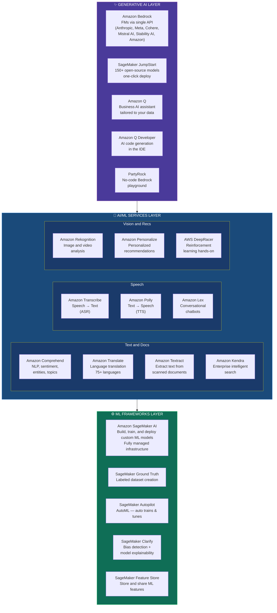


### Complete Service Reference


| Service                     | Layer          | What It Does                              | Key Exam Trigger                        |
| --------------------------- | -------------- | ----------------------------------------- | --------------------------------------- |
| **SageMaker AI**            | ML Frameworks  | Build, train, deploy custom ML models     | "custom model", "full ML workflow"      |
| **SageMaker Ground Truth**  | ML Frameworks  | Create labeled training datasets          | "label data", "annotate"                |
| **SageMaker Autopilot**     | ML Frameworks  | AutoML — auto-trains and tunes best model | "automatically find best model"         |
| **SageMaker Clarify**       | ML Frameworks  | Detect bias, explain predictions (SHAP)   | "explain prediction", "detect bias"     |
| **SageMaker Feature Store** | ML Frameworks  | Store/share features across teams         | "reuse features", "feature consistency" |
| **Amazon Bedrock**          | Generative AI  | Access multiple FMs via single API        | "foundation model", "LLM access"        |
| **SageMaker JumpStart**     | Generative AI  | One-click deploy of 150+ open models      | "quickly deploy open-source model"      |
| **Amazon Q**                | Generative AI  | Business AI assistant                     | "company data assistant"                |
| **Amazon Q Developer**      | Generative AI  | Code generation in the IDE                | "code suggestions", "IDE", "developer"  |
| **Amazon Comprehend**       | AI/ML Services | NLP — sentiment, entities, topics         | "analyze text", "sentiment analysis"    |
| **Amazon Translate**        | AI/ML Services | Language translation                      | "translate", "localize"                 |
| **Amazon Textract**         | AI/ML Services | Extract from scanned documents            | "scanned forms", "extract tables"       |
| **Amazon Kendra**           | AI/ML Services | Enterprise intelligent search             | "search company documents"              |
| **Amazon Transcribe**       | AI/ML Services | Speech → text (ASR)                       | "convert audio", "subtitles"            |
| **Amazon Polly**            | AI/ML Services | Text → speech (TTS)                       | "read text aloud", "voice app"          |
| **Amazon Lex**              | AI/ML Services | Build conversational chatbots             | "chatbot", "voice interface", "intent"  |
| **Amazon Rekognition**      | AI/ML Services | Image/video analysis                      | "images", "faces", "video analysis"     |
| **Amazon Personalize**      | AI/ML Services | Personalized recommendations              | "recommendations", "personalized"       |
| **AWS DeepRacer**           | AI/ML Services | Reinforcement learning race car           | "reinforcement learning hands-on"       |


---

## 13. Cost Considerations

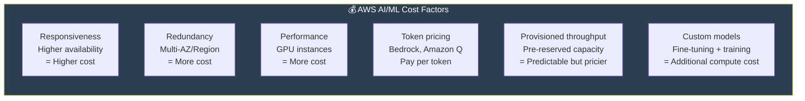


### Cost Optimization Decision Tree

```
Need real-time response?
  ├── YES → Use SageMaker Real-Time Endpoint
  │           Consider: Serverless Inference for infrequent traffic
  └── NO  → Use SageMaker Batch Transform (cheaper, on-demand)

Optimizing an FM?
  ├── Tight budget → Prompt Engineering first (free)
  ├── Need live/changing data → RAG (no retraining cost)
  └── Need domain specialization → Fine-tuning (highest cost)

Token usage (Bedrock)?
  └── Fewer tokens in prompt = lower cost
      → Use prompt engineering to be concise
```

---

## 14. Exam Cheat Sheet

### Service Selector

```
Analyze text sentiment or entities?              → Amazon Comprehend
Extract text from a scanned document/form?       → Amazon Textract
Translate content to another language?           → Amazon Translate
Build a chatbot or voice assistant?              → Amazon Lex
Convert audio/speech to text?                   → Amazon Transcribe
Convert text to lifelike speech?                → Amazon Polly
Analyze images or videos for objects/faces?     → Amazon Rekognition
Search across company documents?                → Amazon Kendra
Personalized product recommendations?           → Amazon Personalize
Hands-on reinforcement learning?                → AWS DeepRacer
Build and train a custom ML model?              → Amazon SageMaker AI
Label training data with human reviewers?       → SageMaker Ground Truth
Explain model predictions / detect bias?        → SageMaker Clarify
Auto-find the best ML model for your data?      → SageMaker Autopilot
Access multiple foundation models via one API?  → Amazon Bedrock
Quick deploy of open-source models?             → SageMaker JumpStart
AI assistant using company's own data?          → Amazon Q
AI code generation in the IDE?                 → Amazon Q Developer
```

### Optimization Selector

```
Fastest, no cost?                       → Prompt Engineering
Private/live data, no retraining?       → RAG
Domain-specific language and tone?      → Fine-tuning
Data changes frequently?                → RAG (not fine-tuning)
Does RAG change model weights?          → NO
Does fine-tuning change model weights?  → YES
```

### Learning Type Selector

```
Labeled data, predict output?           → Supervised learning
No labels, find patterns?               → Unsupervised learning
Rewards/penalties, trial and error?     → Reinforcement learning
Small labeled + large unlabeled?        → Semi-supervised learning
```

---

*Last updated: 2026 | AWS AI Practitioner (AIF-C01) | Module 1*