# Module 2: Exploring Artificial Intelligence Use Cases and Applications

> **Course:** AWS Artificial Intelligence Practitioner (AIF-C01)
> **Source:** Exploring Artificial Intelligence Use Cases and Applications — AWS / Coursera
> **Renders best on GitHub** — Mermaid diagrams display automatically

---

## Table of Contents

1. [AI/ML/DL/GenAI — Quick Review](#1-aimldlgenai--quick-review)
2. [Real-World AI Use Cases by Industry](#2-real-world-ai-use-cases-by-industry)
3. [AI Applications](#3-ai-applications)
4. [When AI and ML Are (and Are Not) Appropriate](#4-when-ai-and-ml-are-and-are-not-appropriate)
5. [ML Techniques and Use Cases](#5-ml-techniques-and-use-cases)
6. [Generative AI Capabilities](#6-generative-ai-capabilities)
7. [Challenges of Generative AI](#7-challenges-of-generative-ai)
8. [Selecting a Generative AI Model](#8-selecting-a-generative-ai-model)
9. [Amazon Bedrock Model Reference](#9-amazon-bedrock-model-reference)
10. [Business Metrics for Generative AI](#10-business-metrics-for-generative-ai)
11. [Exam Cheat Sheet](#11-exam-cheat-sheet)

---

## 1. AI/ML/DL/GenAI — Quick Review

> Module 2 begins with a review of the same hierarchy from Module 1. Ensure these definitions are locked in.

```
╔══════════════════════════════════════════════════════════════╗
║  Artificial Intelligence (AI)                                ║
║  Intelligent systems mimicking human perception, reasoning,  ║
║  learning, problem-solving, and decision-making              ║
║  ╔══════════════════════════════════════════════════════╗    ║
║  ║  Machine Learning (ML)                               ║    ║
║  ║  Subset of AI — machines learn from data             ║    ║
║  ║  ╔══════════════════════════════════════════════╗    ║    ║
║  ║  ║  Deep Learning (DL)                          ║    ║    ║
║  ║  ║  Neurons and synapses — mimics the brain     ║    ║    ║
║  ║  ║  ╔══════════════════════════════════════╗    ║    ║    ║
║  ║  ║  ║  Generative AI                       ║    ║    ║    ║
║  ║  ║  ║  Subset of DL — creates new content  ║    ║    ║    ║
║  ║  ║  ║  without retraining or fine-tuning   ║    ║    ║    ║
║  ║  ║  ╚══════════════════════════════════════╝    ║    ║    ║
║  ║  ╚══════════════════════════════════════════════╝    ║    ║
║  ╚══════════════════════════════════════════════════════╝    ║
╚══════════════════════════════════════════════════════════════╝
```

### Generative AI — Key Capabilities (review)

Generative AI can create new content including:


| Content Type       | Examples                         |
| ------------------ | -------------------------------- |
| **Conversations**  | Chatbots, virtual assistants     |
| **Stories / Text** | Articles, summaries, reports     |
| **Images**         | Product photos, marketing assets |
| **Videos**         | Synthetic media, animations      |
| **Music**          | Compositions, sound design       |
| **Code**           | Functions, scripts, debugging    |


---

## 2. Real-World AI Use Cases by Industry

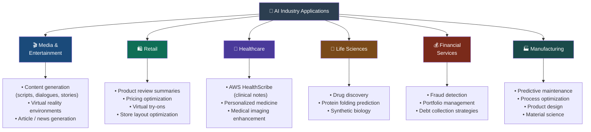


### Industry Use Cases — Expanded Reference

#### 🎬 Media and Entertainment


| Use Case           | Description                                                                  |
| ------------------ | ---------------------------------------------------------------------------- |
| Content generation | AI creates scripts, dialogues, and complete stories for films, TV, and games |
| Virtual reality    | AI builds immersive, interactive virtual environments                        |
| News generation    | AI generates articles and summaries from raw data or events                  |


#### 🛍️ Retail


| Use Case                  | Description                                                    |
| ------------------------- | -------------------------------------------------------------- |
| Product review summaries  | Condenses reviews so shoppers find relevant info quickly       |
| Pricing optimization      | Models scenarios to find optimal pricing for maximum profit    |
| Virtual try-ons           | Generates virtual customer models for online clothing shopping |
| Store layout optimization | Determines most efficient layouts to boost sales               |


#### 🏥 Healthcare


| Use Case              | Description                                                        |
| --------------------- | ------------------------------------------------------------------ |
| AWS HealthScribe      | Auto-generates clinical notes from patient-clinician conversations |
| Personalized medicine | Generates treatment plans based on patient genetics and lifestyle  |
| Medical imaging       | Enhances, reconstructs, or generates X-rays, MRIs, CT scans        |


#### 🔬 Life Sciences


| Use Case                   | Description                                                       |
| -------------------------- | ----------------------------------------------------------------- |
| Drug discovery             | Generates molecular structures, accelerates drug development      |
| Protein folding prediction | Predicts 3D protein structures from amino acid sequences          |
| Synthetic biology          | Generates designs for engineered organisms or biological circuits |


#### 💰 Financial Services


| Use Case             | Description                                                       |
| -------------------- | ----------------------------------------------------------------- |
| Fraud detection      | Creates synthetic datasets to train better fraud detection models |
| Portfolio management | Simulates market scenarios for investment portfolio creation      |
| Debt collection      | Generates optimal communication strategies for collections        |


#### 🏭 Manufacturing


| Use Case               | Description                                                    |
| ---------------------- | -------------------------------------------------------------- |
| Predictive maintenance | Predicts maintenance schedules from historical production data |
| Process optimization   | Models production scenarios to optimize cost, time, resources  |
| Product design         | Generates multiple design options optimized for set parameters |
| Material science       | Generates new material compositions with desired properties    |


---

## 3. AI Applications

> These four core AI applications appear across all industries. Know which industry maps to which application.

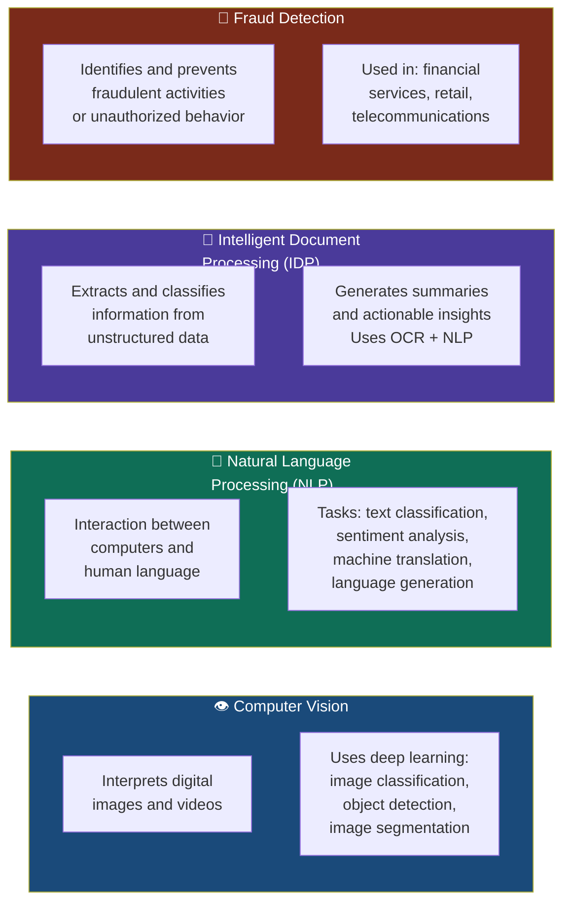


### Application → Industry Mapping

```
┌──────────────────────────┬──────────────────────────────────────────────────────┐
│ APPLICATION              │ INDUSTRY EXAMPLES                                    │
├──────────────────────────┼──────────────────────────────────────────────────────┤
│ Computer Vision          │ • Automotive: self-driving cars (safety)             │
│                          │ • Healthcare: medical imaging (better diagnosis)     │
│                          │ • Public safety: facial recognition (crime deterrent)│
│ Business value           │ Enhance customer experience, Improve operations      │
├──────────────────────────┼──────────────────────────────────────────────────────┤
│ NLP                      │ • Insurance: extract policy numbers, redact PII      │
│                          │ • Telecom: personalized recommendations from texts   │
│                          │ • Education: Q&A chatbots for students               │
│ Business value           │ Sensitive data redaction, Customer engagement        │
├──────────────────────────┼──────────────────────────────────────────────────────┤
│ IDP                      │ • Financial services: mortgage application processing│
│                          │ • Legal: process contracts, agreements, court filings│
│                          │ • Healthcare: claims processing, doctor's notes      │
│ Business value           │ Improve business operations, Automation              │
├──────────────────────────┼──────────────────────────────────────────────────────┤
│ Fraud Detection          │ • Financial services: identity verification, AML     │
│                          │ • Retail: protect from financial losses, account data│
│                          │ • Telecom: roaming fraud, subscription fraud         │
│ Business value           │ Improve business operations                          │
└──────────────────────────┴──────────────────────────────────────────────────────┘
```

### IDP Components

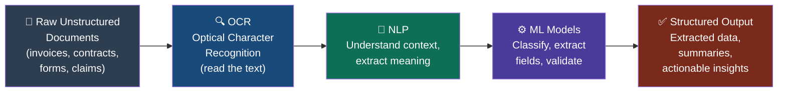


---

## 4. When AI and ML Are (and Are Not) Appropriate

### Use AI/ML When:

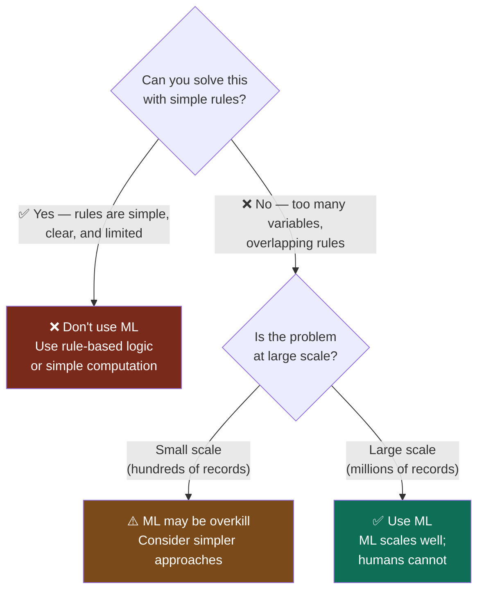


### Decision Table


| Situation                                      | Recommended Approach                    |
| ---------------------------------------------- | --------------------------------------- |
| Rules are simple, clear, and finite            | ❌ Don't use ML — use rule-based code    |
| Target value can be calculated by formula      | ❌ Don't use ML — use direct computation |
| Rules rely on many overlapping factors         | ✅ Use ML                                |
| Task needs to scale to millions of records     | ✅ Use ML                                |
| Human labeling is feasible and data is limited | Consider rule-based first               |
| Patterns are unknown and need to be discovered | ✅ Use unsupervised ML                   |


### Classic Example — Spam Filtering

```
Rule-based approach:          ML approach:
─────────────────────         ─────────────────────
IF subject contains           Trained on millions of
"FREE MONEY" → spam           labeled emails, learns
IF sender unknown → spam      complex patterns of
...hundreds more rules...     spam automatically.
Hard to maintain, fails       Scales to millions of
on new spam patterns          emails, improves over time
```

---

## 5. ML Techniques and Use Cases

### Full Taxonomy

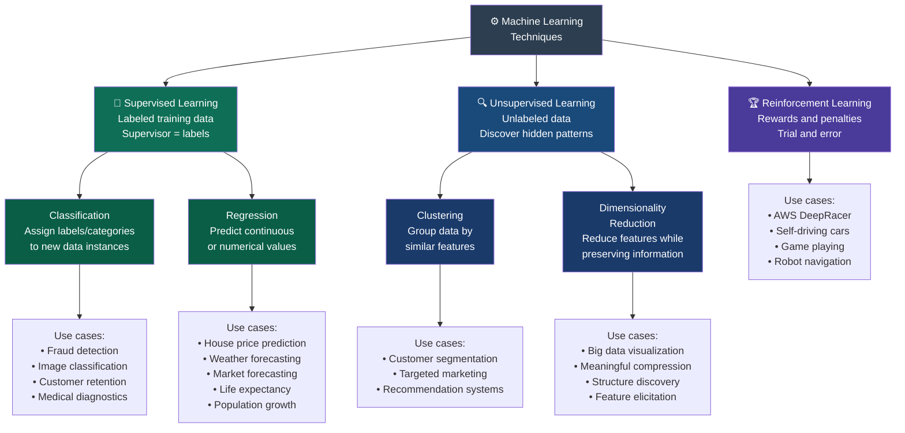


### Supervised Learning — Deep Dive

```
HOW IT WORKS:
  Labeled data ──→ Model trains ──→ Learns patterns ──→ Predicts on new data

EXAMPLE (Image Classification):
  [Car photo #1] + label "car" ─┐
  [Car photo #2] + label "car" ─┼──→ [Model] ──→ New unlabeled photo ──→ "car"
  [Car photo #3] + label "car" ─┘

CLASSIFICATION vs REGRESSION:
  ┌─────────────────┬────────────────────────────────────────┐
  │ Classification  │ Output is a CATEGORY / LABEL           │
  │                 │ Example: Is this email spam? Yes / No  │
  │                 │ Example: Is this tumor malignant?      │
  ├─────────────────┼────────────────────────────────────────┤
  │ Regression      │ Output is a NUMBER / CONTINUOUS VALUE  │
  │                 │ Example: What will the house sell for? │
  │                 │ Example: What will tomorrow's temp be? │
  └─────────────────┴────────────────────────────────────────┘
```

### Unsupervised Learning — Deep Dive

```
HOW IT WORKS:
  Unlabeled data ──→ Model finds structure ──→ Creates its own labels/groups

EXAMPLE (Clustering):
  Customer transactions (no labels) ──→ Model discovers:
  Group A: High-spend, frequent buyers   (→ "Premium customers")
  Group B: Low-spend, occasional buyers  (→ "Casual shoppers")
  Group C: Bulk orders, low frequency    (→ "Business buyers")

CLUSTERING vs DIMENSIONALITY REDUCTION:
  ┌──────────────────────────┬──────────────────────────────────────────┐
  │ Clustering               │ Groups data points by similarity         │
  │                          │ Example: segment customers by behavior   │
  ├──────────────────────────┼──────────────────────────────────────────┤
  │ Dimensionality Reduction │ Reduces number of features in a dataset  │
  │                          │ Keeps most important information         │
  │                          │ Example: compress 100 features → 10      │
  └──────────────────────────┴──────────────────────────────────────────┘
```

### Reinforcement Learning — AWS DeepRacer Example

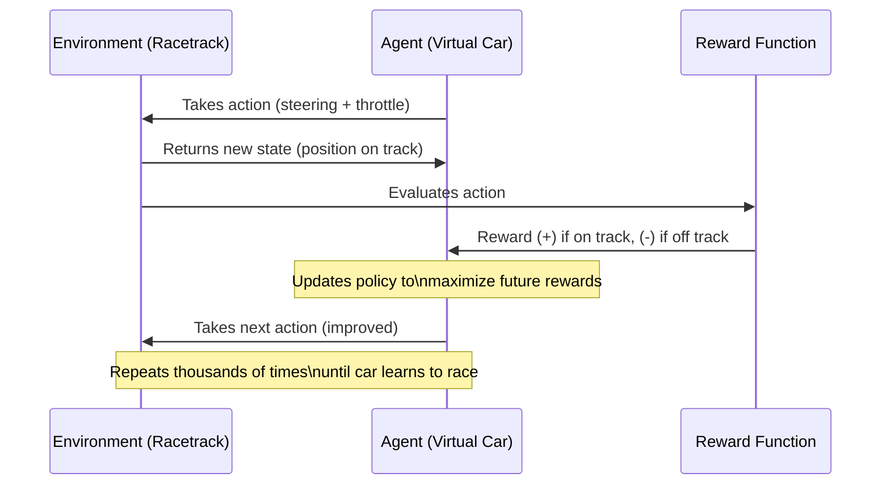


---

## 6. Generative AI Capabilities

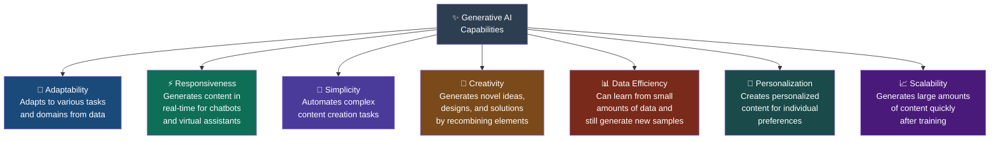


### Capabilities Summary Table


| Capability          | Definition                        | Business Example                                  |
| ------------------- | --------------------------------- | ------------------------------------------------- |
| **Adaptability**    | Flexible across tasks and domains | Same FM used for HR, legal, and marketing content |
| **Responsiveness**  | Generates content in real-time    | Live chatbot responses to customer queries        |
| **Simplicity**      | Automates content creation        | Auto-drafts product descriptions from specs       |
| **Creativity**      | Generates novel ideas             | New product design variations from constraints    |
| **Data Efficiency** | Learns from small datasets        | Fine-tuned on 500 examples; generalizes well      |
| **Personalization** | Tailors content to individuals    | Personalized email campaigns per customer         |
| **Scalability**     | Produces content at massive scale | Generate 1M product descriptions overnight        |


> **⚠️ Exam Key:** The exam may ask you to select capabilities from a list. The core 7 are: Adaptability, Responsiveness, Simplicity, Creativity, Data Efficiency, Personalization, Scalability. **Conversion rate and ARPU are business metrics — NOT capabilities.**

---

## 7. Challenges of Generative AI

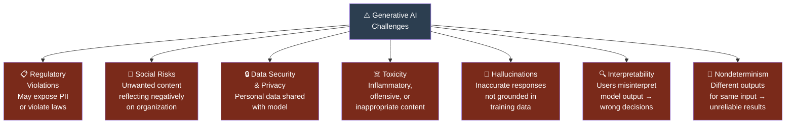


### Challenges — Risk and Mitigation

```
┌─────────────────────┬──────────────────────────────┬─────────────────────────────────────┐
│ CHALLENGE           │ RISK                         │ MITIGATION                          │
├─────────────────────┼──────────────────────────────┼─────────────────────────────────────┤
│ Regulatory          │ Generates output that        │ Data anonymization; audits and       │
│ Violations          │ exposes PII or violates       │ assessments of training data         │
│                     │ compliance regulations        │                                     │
├─────────────────────┼──────────────────────────────┼─────────────────────────────────────┤
│ Social Risks        │ Unwanted content reflects    │ Test and evaluate all models         │
│                     │ negatively on organization   │ before production deployment         │
├─────────────────────┼──────────────────────────────┼─────────────────────────────────────┤
│ Data Security       │ Personal information shared  │ Encrypt data in transit and at rest; │
│ & Privacy           │ with model may violate       │ IAM, KMS, VPC controls;              │
│                     │ privacy laws                 │ Amazon Bedrock Guardrails            │
├─────────────────────┼──────────────────────────────┼─────────────────────────────────────┤
│ Toxicity            │ Model generates offensive    │ Curate training data; remove toxic   │
│                     │ or inappropriate content     │ phrases; use guardrail models        │
├─────────────────────┼──────────────────────────────┼─────────────────────────────────────┤
│ Hallucinations      │ Model generates inaccurate   │ Teach users to verify all outputs;   │
│                     │ responses not based in       │ mark generated content as unverified;│
│                     │ reality                      │ use RAG for grounded responses       │
├─────────────────────┼──────────────────────────────┼─────────────────────────────────────┤
│ Interpretability    │ Users misinterpret output,   │ Use domain knowledge for model dev;  │
│                     │ leading to wrong decisions   │ provide key info in inputs           │
├─────────────────────┼──────────────────────────────┼─────────────────────────────────────┤
│ Nondeterminism      │ Different outputs for same   │ Test model repeatedly; compare       │
│                     │ input — unreliable results   │ outputs; identify sources of drift   │
└─────────────────────┴──────────────────────────────┴─────────────────────────────────────┘
```

### Hallucinations — Explained

```
What happens:
  User asks: "What is the capital of Australia?"
  Model says: "The capital of Australia is Sydney." ← HALLUCINATION
                                                       (Correct answer: Canberra)

Why it happens:
  The model generates statistically likely text — not verified facts.
  It "sounds confident" but is not checking against a source of truth.

Mitigation options:
  1. RAG — ground responses in retrieved documents
  2. Teach users to always verify AI-generated content
  3. Mark all generated content as "unverified"
  4. Amazon Bedrock Guardrails — filter outputs
```

---

## 8. Selecting a Generative AI Model

### Five Key Factors

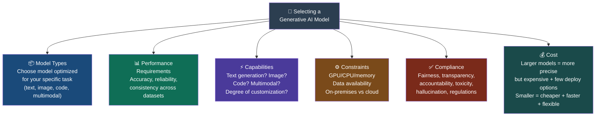


### Cost Trade-off: Model Size

```
LARGER MODELS:                    SMALLER MODELS:
──────────────                    ───────────────
✅ More precise / accurate        ✅ Cheaper to run
✅ Better at complex tasks        ✅ Faster inference
❌ More expensive                 ✅ More deployment options
❌ Fewer deployment options       ❌ Less accurate on complex tasks
❌ Higher latency                 ❌ May need fine-tuning for quality
```

### Compliance Factors to Consider


| Factor                          | Definition                                              |
| ------------------------------- | ------------------------------------------------------- |
| **Fairness**                    | Does the model treat all groups equitably?              |
| **Transparency / Traceability** | Can you explain how the model reached its output?       |
| **Accountability**              | Is there a clear owner responsible for model decisions? |
| **Hallucination**               | Does the model produce false or unverified content?     |
| **Toxicity**                    | Does the model generate offensive or harmful content?   |


---

## 9. Amazon Bedrock Model Reference

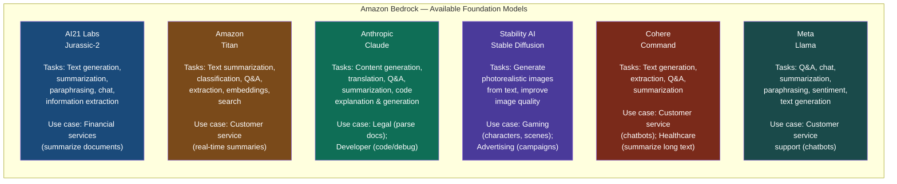


### Model Quick-Reference Table


| Provider         | Model            | Best Tasks                                    | Exam Use Case Trigger                           |
| ---------------- | ---------------- | --------------------------------------------- | ----------------------------------------------- |
| **AI21 Labs**    | Jurassic-2       | Text generation, summarization, paraphrasing  | "Summarize lengthy financial documents"         |
| **Amazon**       | Titan            | Summarization, Q&A, embeddings, search        | "Customer service summaries"; "semantic search" |
| **Anthropic**    | Claude           | Code generation, legal docs, Q&A, translation | "Code debugging"; "parse legal documents"       |
| **Stability AI** | Stable Diffusion | Text-to-image generation                      | "Generate product images"; "advertising assets" |
| **Cohere**       | Command          | Text generation, summarization, Q&A           | "Support chatbots"; "healthcare text summaries" |
| **Meta**         | Llama            | Chat, Q&A, sentiment analysis                 | "Customer service chatbots"                     |


---

## 10. Business Metrics for Generative AI

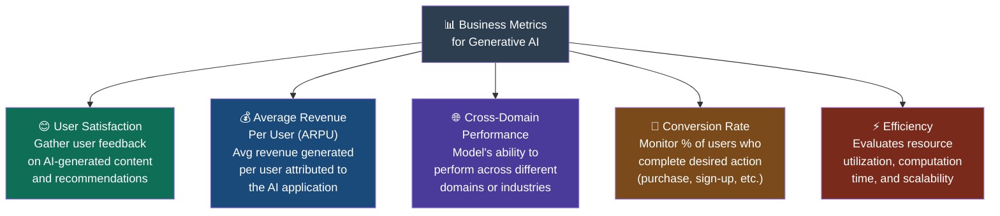


### Business Metrics — Detailed Reference

```
┌──────────────────────────┬─────────────────────────────────┬─────────────────────────────────┐
│ METRIC                   │ WHAT IT MEASURES                │ EXAMPLE USE CASE                │
├──────────────────────────┼─────────────────────────────────┼─────────────────────────────────┤
│ User Satisfaction        │ How satisfied users are with    │ E-commerce: surveys after AI    │
│                          │ AI-generated outputs            │ product recommendations         │
├──────────────────────────┼─────────────────────────────────┼─────────────────────────────────┤
│ ARPU                     │ Average revenue per user from   │ E-commerce: revenue from users  │
│ (Avg Revenue Per User)   │ AI-driven interactions          │ who engaged with AI suggestions │
├──────────────────────────┼─────────────────────────────────┼─────────────────────────────────┤
│ Cross-Domain Performance │ Model effectiveness across      │ Multi-category e-commerce:      │
│                          │ multiple domains/industries     │ performance across all product  │
│                          │                                 │ categories and regions          │
├──────────────────────────┼─────────────────────────────────┼─────────────────────────────────┤
│ Conversion Rate          │ % of users who complete a       │ Online store: % of visitors who │
│                          │ desired action (purchase, etc.) │ buy after AI recommendations    │
├──────────────────────────┼─────────────────────────────────┼─────────────────────────────────┤
│ Efficiency               │ Resource usage, compute time,   │ Manufacturing: AI optimizes     │
│                          │ and scalability                 │ production line resource usage  │
└──────────────────────────┴─────────────────────────────────┴─────────────────────────────────┘
```

> **⚠️ Exam Key:** Business metrics ≠ GenAI capabilities. The exam may try to mix them. Conversion Rate, ARPU, and Cross-Domain Performance are **metrics**, not capabilities. Personalization, Scalability, and Simplicity are **capabilities**, not metrics.

---

## 11. Exam Cheat Sheet

### Industry → AI Use Case Mapping

```
Autonomous driving / self-driving cars     → Computer Vision
Medical imaging (X-rays, MRIs, CT scans)   → Computer Vision / Healthcare AI
Clinical notes from conversations          → AWS HealthScribe (NLP)
Drug discovery / protein folding           → Life Sciences AI
Fraud detection / AML                      → Fraud Detection / Financial AI
Portfolio management / market simulation   → Financial Services AI
Predictive maintenance on machines         → Manufacturing AI
Product descriptions at scale              → Retail AI / Generative AI
Virtual try-ons for online shoppers        → Retail AI
Article / news generation                  → Media & Entertainment AI
Extract fields from contracts/invoices     → IDP (Intelligent Document Processing)
Insurance: extract policy numbers, PII     → NLP
Student Q&A chatbots in education          → NLP
Telecom: personalized SMS recommendations  → NLP
```

### ML Technique → Task Mapping

```
Predicting a NUMBER (house price, temperature)     → Regression (Supervised)
Predicting a CATEGORY (spam/not spam, fraud/not)   → Classification (Supervised)
Grouping similar items (customer segments)         → Clustering (Unsupervised)
Reducing number of features in a dataset           → Dimensionality Reduction (Unsupervised)
Agent learns through rewards/penalties             → Reinforcement Learning
AWS DeepRacer                                      → Reinforcement Learning
```

### GenAI Capabilities vs. Business Metrics

```
CAPABILITIES (what the model can do):          BUSINESS METRICS (how we measure success):
• Adaptability                                 • User Satisfaction
• Responsiveness                               • Average Revenue Per User (ARPU)
• Simplicity                                   • Cross-Domain Performance
• Creativity                                   • Conversion Rate
• Data Efficiency                              • Efficiency
• Personalization
• Scalability
```

### GenAI Challenges — One-Line Summary

```
Regulatory violations  → Outputs may expose PII or violate compliance rules
Social risks           → Content may damage organizational reputation
Data security/privacy  → Sensitive data shared with model may leak
Toxicity               → Model may generate offensive or harmful content
Hallucinations         → Model confidently states things that are false
Interpretability       → Users misunderstand model outputs → bad decisions
Nondeterminism         → Same input produces different outputs → unreliable
```

### Model Selection Factors

```
1. Model type         → Does it match your task? (text, image, code, multimodal)
2. Performance        → Accuracy, reliability, consistency
3. Capabilities       → Does it support your specific requirements?
4. Constraints        → GPU, memory, on-prem vs cloud
5. Compliance         → Fairness, transparency, toxicity, hallucinations
6. Cost               → Larger = precise but expensive; smaller = fast and flexible
```

---

*Last updated: 2026 | AWS AI Practitioner (AIF-C01) | Module 2*